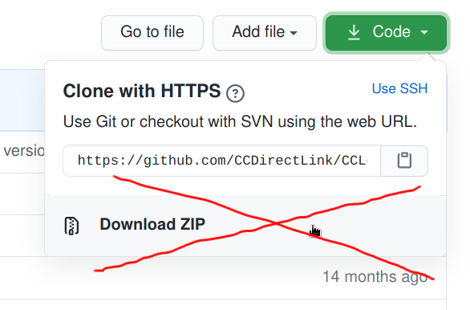
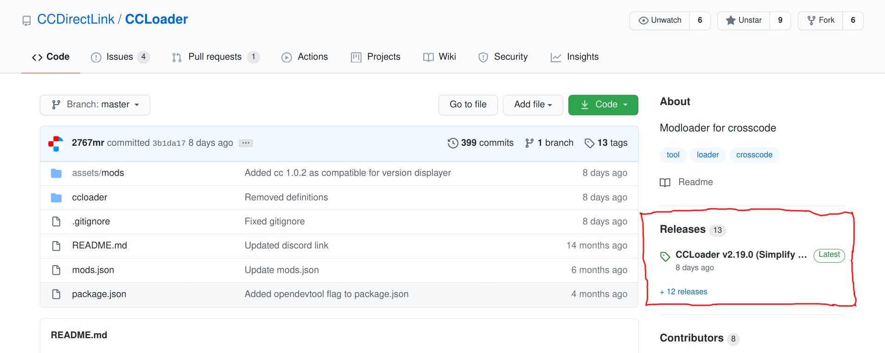
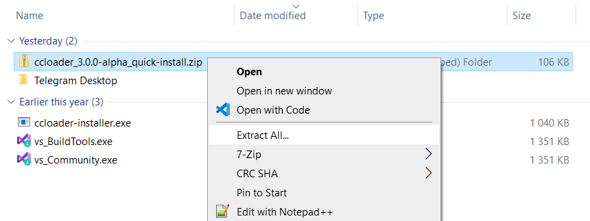
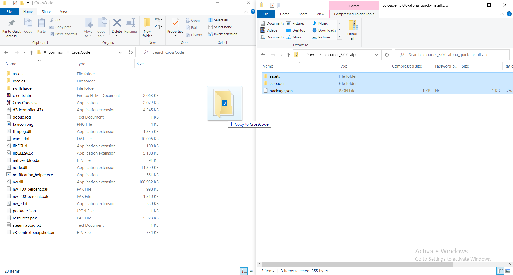
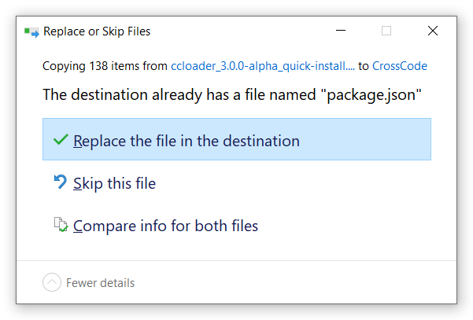
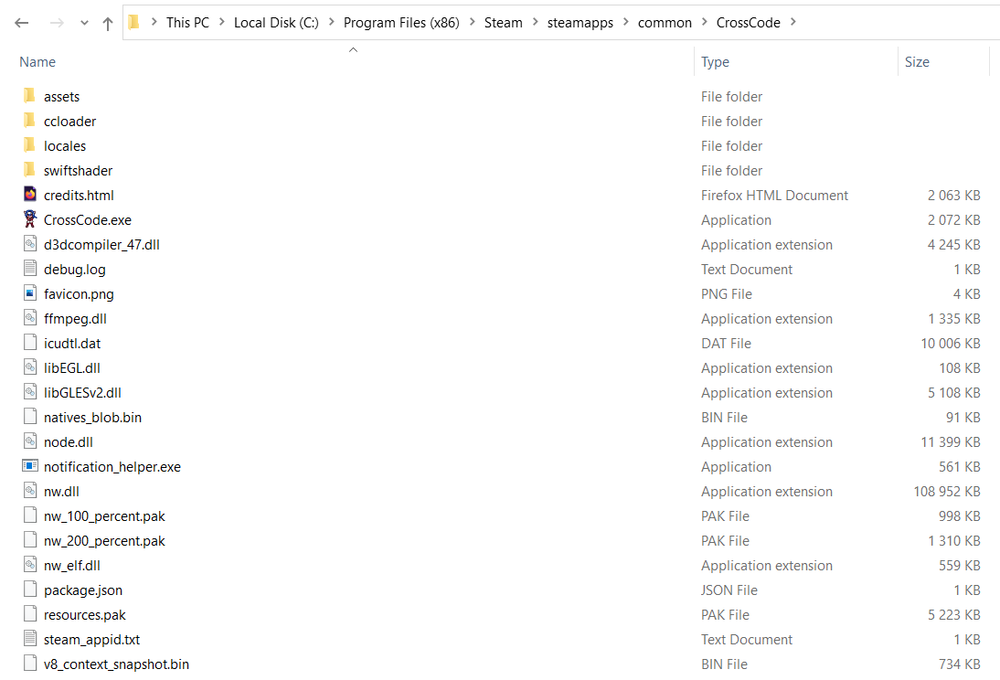

# Installing and updating CCLoader

**CCLoader** is the de facto modloader for CrossCode and obviously a prerequisite for playing the CrossCode with mods. Really, it is the only actively developed modloader intended for use by both mod users and mod developers (RIP [Rapture](https://github.com/20kdc/decrossfuscator/blob/master/lib/rapture.js) + [pre-1.1.0 mods](https://github.com/20kdc/decrossfuscator/tree/master/mods), [Dorito](https://github.com/Nnubes256/Dorito) and [CCInjector](https://github.com/CCDirectLink/CCInjector)).

There are three ways to perform CCLoader installation, they are both described in this document. But before we continue:

## VERY IMPORTANT NOTE: Don't use the green "clone or download button"!



This button downloads the source code, not the compiled files! In the case of CCLoader you can't just download the source code and run it because CCLoader is not written in JavaScript! While this doesn't apply to all CrossCode mods out there as most of them are written in plain JS and as such don't need to be compiled, **you should get used to looking at the "Releases" page first before trying to download the source code**. In the new redesigned GitHub UI the link to it became more apparent:



## Method 1: Quick-installation archive

This method is recommended for most users (at least right now because the mod manager is not stable enough for a public release and has a few critical bugs) and will very likely remain the primary installation method because of its simplicity.

1. Obviously, first of all you have to locate the [CrossCode game files folder](../where-are-crosscode-files-located.md#game-files-folder).
2. Go to the [latest release page](https://github.com/dmitmel/ccloader3/releases/latest) of CCLoader. (TODO update the URL when v3 is released)
3. Download the archive named **`ccloader_X.Y.Z_quick-install.zip`** (`tar.gz` archives also exist for GNU/Linux and macOS users). **It is important that you download the archive named `quick-install` and not the source code or something else.**
4. Extract this archive somewhere:

   

5. Copy the files inside the archive directly into the game folder, like this:

   

   The only file you'll have to overwrite in a clean CrossCode installation is the `package.json`:

   

6. You've now successfully installed CCLoader! The end result should look like (notice the new `ccloader` folder):

   

   Mods can be installed into the `mods` folder located inside `assets`, for more information on that see the [relevant guide](installing-mods.md).

### Bonus for Linux users

On Linux this entire process can be performed with two commands:

```bash
cd /path/to/CrossCode
# TODO update the URL here as well
curl --location --fail 'https://github.com/dmitmel/ccloader3/releases/download/v3.0.0-alpha/ccloader_3.0.0-alpha_quick-install.tar.gz' \
  | tar --extract --gzip --verbose --file -
```

## Method 2: Using the automatic installer

See <https://github.com/CCDirectLink/ccloader-installer>. It may be broken though.

## Method 3: Manual installation of the CCLoader-only package

This method is not really intended for regular users, rather this section is a description of the full installation process intended as a reference when implementing tools for automatic CCLoader installation. It is also subject to change in the future, although that's not likely.

1. Locate the [CrossCode game files directory](../where-are-crosscode-files-located.md#game-files-folder).
2. Create a directory for CCLoader files, named, for example, `ccloader`.
3. Download and unpack the release archive named `ccloader_X.Y.Z_package.zip` or `ccloader_X.Y.Z_package.tar.gz` into this directory.
4. Change the `main` field in game's `package.json` from `assets/node-webkit.html` to `ccloader/main.html`.
5. Create a directory named `mods` inside game's `assets`.
6. The installation is complete.
