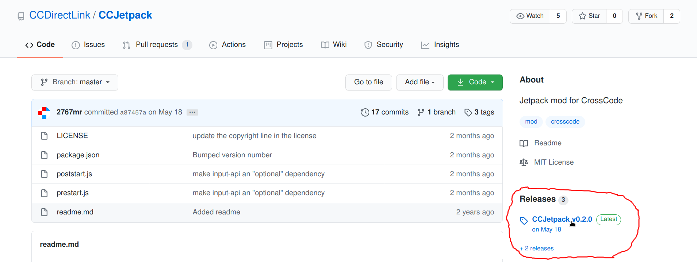
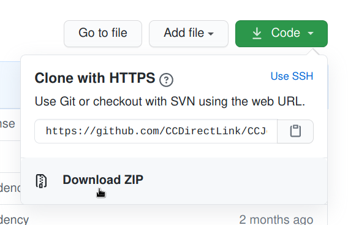
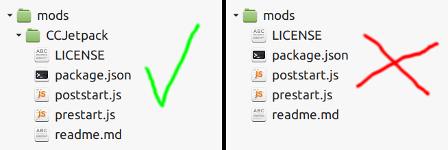

# Installing and updating mods

This guide describes the most common way of installation of perfectly regular CrossCode mods. Granted, not every mod is equal, some may require additional setup before or after installation, but that must be described in mod's README document. If not - well, this is most likely the mod author's problem. Note that you don't have to read this guide each time you download a new mod as this page is intended for absolute beginners.

## Short note about upgrading mods

You **can** perform mod upgrades by performing the steps described in this guide, but replacing all previous files when unpacking the downloaded mod. However, **this is not recommended** (by me at least) - instead you should first delete the folder with the previous version of the mod you are upgrading and only then unpack the new version, just in case.

## Step 1. [Install CCLoader](installing-ccloader.md)

CCLoader (aka the **C**ross**C**ode mod**loader**) is required for most mods nowadays to work. Well, it is possible to ~~ab~~use the DLC/extension system for creating simple asset swaps, but these are its limits - it's _definitely_ not designed for full-fledged modding. CCLoader also provides various tooling for mod authors for selectively patching game content, so that mod authors can put just the changed bits of game files in their mods instead of copying them entirely. The guide about CCLoader installation can be found [here](installing-ccloader.md).

## Step 2. Get the mod files

Most mods are distributed as zip archives. There are two ways to obtain those:

### Downloading releases

_See also [this section](installing-ccloader.md#very-important-note-dont-use-the-green-clone-or-download-button) of the CCLoader installation guide_

Unless explicitely stated otherwise in the mod's README, **when actually downloading mods you should always check first for released versions**, or "releases" for short. Most mod authors use GitHub for storing source code and distributing releases where you can access the page with changelogs and downloads through these links:

Pressing on the version marked as "latest" will take you to, unsurprisingly, the page of the latest release, pressing on the `Releases (N)` or `+N releases` links at the top and bottom (where `N` is some number) will take you to a list of all available versions. Mods also often include the following badge in their README which takes you directly to downloads:

](https://raw.githubusercontent.com/CCDirectLink/organization/master/assets/badges/releases@2x.png)

On the release page you'll see the section named "Assets". It always includes at least two entries - "Source code (zip)" and "Source code (tar.gz)". If only links for downloading source code are present - don't worry, you can use those to install the mod. Just download whichever archive format you prefer. Otherwise mod authors upload at least zip archives on the downloads page, usually the file name of those includes the mod ID and version.

### Downloading source code

Most of the time mod authors publish the releases properly, but when the "releases" page is empty or the link is hidden it can mean one of three things:

1. The project is dead.
2. The mod is work-in-progress project, or WIP for short. Such mods usually don't have a proper README file. In this case you should contact the author to ask if the mod is usable. You can also potentially help with the development - sometimes mods may need testers.
3. The author was just lazy to publish releases properly. Most mods don't require compilation or preprocessing of assets or scripts to be loaded into the game and work, so in such cases you can try to download the mod's source code. On GitHub this can be done by pressing the green "code" button with a download icon to the left, and then pressing "download ZIP" in the opened popup:

   

**Beware, however, that sometimes the source code of mods is structured in a weird way**, mostly in mods made by ac2pic aka Emileyah, so sometimes you can't just put files of the downloaded archive into your mods folder and call it a day. As a rule of thumb, a folder which contains a file named `ccmod.json` is most likely a mod. In the case of ac2pic's mods, the mod is usually located in a subfolder named similarly to the mod itself.

## Step 3. Unpack the downloaded mod into your mods folder

To locate your mods folder you first need to find the [CrossCode game files folder](../where-are-crosscode-files-located.md#game-files-folder), then go to `assets`, then `mods`. If the folder `mods` doesn't exist - create it. Then unpack the mod folder contained in the archive you downloaded there. Be sure to put the mod folder in `mods`, not the files inside because **each mod lives in its own separate folder**! You can also ensure that the folder you unpacked contains a file named `ccmod.json`.

**NOTE:** these screenshots are a bit outdated (TODO update, include multiple mods to better demonstrate the idea), for example because they doesn't contain `ccmod.json`, but I hope you get the correct idea.

## Step 4. PROFIT!!!11!1!!!

This basically concludes installation of perfectly regular mods.
