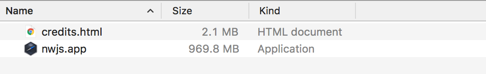

# Where are CrossCode files located?

## Saves

There isn't really much to say about this folder other than:

1. It isn't located in the [**game files folder**](#game-files-folder), so you can delete and reinstall the game without losing your progress or settings.
2. It is located in the nw.js's browser cache folder.

Here're the direct paths to the save file on various platforms:

| Platform       | Installation path                                         |
| :------------- | :-------------------------------------------------------- |
| **MS Windows** | `%LOCALAPPDATA%\CrossCode\cc.save`                        |
| **GNU/Linux**  | `~/.config/CrossCode/Default/cc.save`                     |
| **macOS**      | `~/Library/Application Support/CrossCode/Default/cc.save` |

Similarly named files `cc.save.backup` and `cc.save.backup2` exist and can be used to restore the save file in case it becomes corrupt.

For now this section is incomplete and more information can be obtained on the [game's wiki](https://crosscode.gamepedia.com/Savegame).

## Game installation folder

Why are you asking me where you installed the game? You would probably know that better than myself. However, here's a quick way to locate the installation folder in case you are using Steam:

1. Find CrossCode in your game library.
2. Right-click it, in the context menu press `Properties...`.

   

3. In the new window select the `LOCAL FILES` tab.
4. You'll be presented with the following menu:

   

   Click the `BROWSE LOCAL FILES...` button and you'll be taken to the installation folder.

The common paths where Steam installs CrossCode are:

| Platform       | Installation path                                                |
| :------------- | :--------------------------------------------------------------- |
| **MS Windows** | `C:\Program Files\Steam\steamapps\common\CrossCode`              |
| **GNU/Linux**  | `~/.local/share/Steam/steamapps/common/CrossCode`                |
| **macOS**      | `~/Library/Application Support/Steam/steamapps/common/CrossCode` |

Here's how this folder looks on different platforms:

**MS Windows:**

**GNU/Linux:**

**macOS:**

## Game files folder

Due to, uhm... _interesting_ structure of the CrossCode's macOS application, [**game installation folder**](#game-installation-folder) is not necessarily the same as the **game files folder**. It also isn't the same as the [**game assets folder**](#game-assets-folder). Files (HTML pages and JavaScript scripts) in this folder have full access to all of game's nw.js's features, and thus this folder is commonly used as a home for mods, modding tools and CCLoader in particular. On MS Windows and GNU/Linux it is the same as the installation folder, as such it also contains nw.js's files on these platforms.
**Note for people who purchased the game from the Microsoft store**: unfortunately the game files are hidden and/or encrypted in the MS store edition, so there is no way to access or modify them, consider asking someone who bought a DRM-free version of the game to send you those files.

Anyway, here are the contents of this folder on different platforms in a fresh non-modded copy of CrossCode:

**MS Windows:**

**GNU/Linux:**

**macOS:**

There are a few files which are common between all platforms:

- `assets` - obviously, the [**game assets folder**](#game-assets-folder)
- `favicon.png` - the application icon (interestingly enough the `.exe` file for Windows has a different icon)
- `package.json` - contains the path to an HTML page which is opened immediately when you start the game and initial configuration for the window this page is opened in (like dimensions, fullscreen mode, resizable or not etc)
- `steam_appid.txt` - to my knowledge it is created automatically by Steam and in the case of CrossCode just contains the text `368340`

All other files come from the standard nw.js packages [you can download yourself](https://dl.nwjs.io/v0.35.5/) and **weren't created by RadicalFishGames**. All aforementioned files though are identical on all platforms, which means that you can take them from an installation on another platform, download the nw.js package on a different OS, place the game files inside and you'll get a (synthetic, hehe) runnable version of the game on this another OS. (TODO: maybe I should write a guide for that as well)

### How to locate the game files folder?

**MS Windows** and **GNU/Linux**: Simply find your [**game installation folder**](#game-installation-folder), it's the same as the game files folder on these platforms.

**macOS:** Extra care needs to be taken on mac because the game files are stored inside of nw.js's application. After locating the [**game installation folder**](#game-installation-folder) you need to:

1. Right-click the app named `nwjs` or `CrossCode`.
2. In the context menu select `Show Package Contents`.

   

3. Go to the folder named `Contents`, then `Resources`, then `app.nw`.

   

4. Here you go, this is the game files folder!

## Game assets folder

TODO
